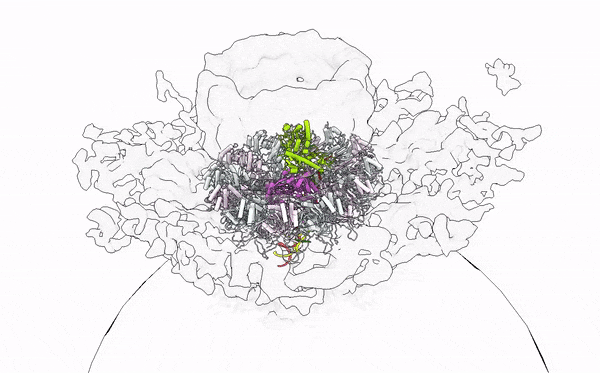

 

  <h1 align="center">Yaw Bia</h1>

  

     
    I’m a structural biologist in infectious disease research field 
     
    with interest in developing biotherapeutic modalities using structure-guided approaches. 
     
     
    I am currently working in <a href="https://www.thrixen.com" target="_blank" rel="noopener noreferrer"> Thrixen<a/> on developing next-generation Point-of-Care diagnostics products, by establishing in-house insilico platforms for protein engineering and computational structural work. 
     
     
    Previous Lab I worked in: <a href="https://blogs.ntu.edu.sg/dhlab/" target="_blank" rel="noopener noreferrer"> Dahai Lab</a> at <a href="https://www.ntu.edu.sg/medicine" target="_blank" rel="noopener noreferrer"> LKCMedicine, NTU</a>, and <a href="https://www.duke-nus.edu.sg/directory/detail/vasudevan-subhash" target="_blank" rel="noopener noreferrer">Subhash's lab<a/> DUKE-NUS Medical School. 
     
    Please view my research publication at <a href="https://scholar.google.com/citations?user=vRS_sU4AAAAJ&hl=en&authuser=1" target="_blank" rel="noopener noreferrer"> google-scholar</a>. 
     
     
    You can reach me at <a href="mailto:tanyawbia6@gmail.com"> tanyawbia6@gmail.com</a> for collaboration.
     
    <strong>Visit my Personal Website» </strong>
    <a href="https://yawbia.github.io/portfolio"> Personal Website </a>.
     
     
    My recent research highlight - Click the image to read more
     
    
  

<!---
yawbia/yawbia is a ✨ special ✨ repository because its `README.md` (this file) appears on your GitHub profile.
You can click the Preview link to take a look at your changes.
--->
